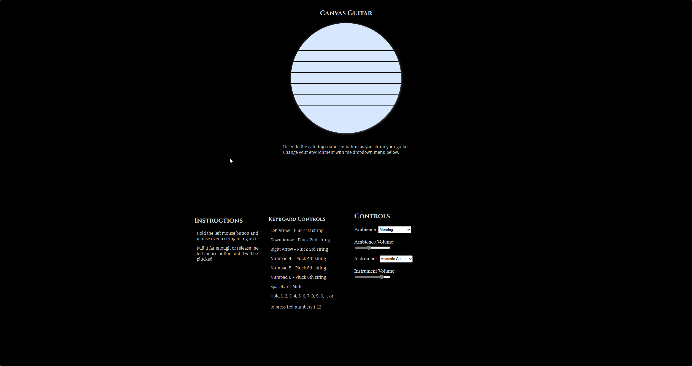

# Canvas Guitar

Link to the application: <https://people.rit.edu/crl3554/330/project1>

YouTube demo: <https://www.youtube.com/watch?v=78dE5XtR1J8>

# Embedded Fonts

[Cinzel](https://fonts.google.com/specimen/Cinzel) by Natanael Gama

[Fauna One](https://fonts.google.com/specimen/Fauna+One) by Eduardo Tunni

# Citations

Tone.js (External sound library) - 
https://tonejs.github.io/

Morning Country Ambience with Birds by freesfx.co - 
https://www.freesfx.co.uk/sfx/morning

"Outdoor Nighttime Ambience.wav" by TaXMaNFoReVeR of freesound.org - 
https://freesound.org/people/TaXMaNFoReVeR/sounds/325426/

"Rain, Moderate, B.wav" by InspectorJ (www.jshaw.co.uk) of freesound.org - 
https://freesound.org/people/InspectorJ/sounds/401276/

Acoustic Guitar Sample Pack by BIOCHRON - https://soundpacks.com/free-sound-packs/acoustic-guitar-sample-pack/

# Log

|  Date   | Description                                                                                          |
|:-------:|------------------------------------------------------------------------------------------------------|
| 9/8/20  | Created repo                                                                                         |
| 9/10/20 | Worked on libraries externally                                                                       |
| 9/13/20 | Added libraries                                                                                      |
| 9/14/20 | Created guitar and plucking functionality                                                            |
| 9/15/20 | Implemented rolling shutter effect                                                                   |
| 9/16/20 | Added sounds, keyboard support, instructions, and some controls                                      |
| 9/17/20 | Improved styles & added the all-important favicon                                                    |
| 9/20/20 | Created background color interpolation & added falling raindrops                                     |
| 9/21/20 | Added coyote time to fretting & saving controls preferences                                          |
| 9/22/20 | Fixed volume sliders, made ambience audios fade between each other & created acoustic guitar sampler |
| 9/23/20 | Finished documentation & recorded demo reel                                                          |
